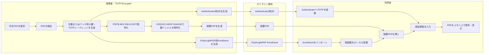

<!-- TOTP Security Flowchart -->README.md
# TOTP Security Technical Specification

## システム全体フロー



## PDF暗号化・バッチ作成フロー

```mermaid
flowchart TD
    S([暗号化開始]) --> M{処理モード}

    M -->|新規文書／新規バッチ| N1[平文PDFを選択]
    M -->|既存バッチへ追加| B1[.flpdf-batchを選択]

    B1 --> B2[管理者パスフレーズを入力]
    B2 --> B3{プロジェクトの<br/>復号・認証に成功?}
    B3 -->|いいえ| E1[エラー表示]
    E1 --> X([処理終了])
    B3 -->|はい| B4[既存のbatch_id・受信者鍵・<br/>K_totp・有効期間ポリシーを復元]
    B4 --> N1

    N1 --> V1{入力PDFは<br/>正常に解析可能?}
    V1 -->|いいえ| E2[不正なPDFとして拒否]
    E2 --> X
    V1 -->|はい| SCOPE{鍵スコープ}

    SCOPE -->|文書単位・既定| K1[文書ごとに受信者X25519鍵ペアと<br/>K_totpを生成]
    SCOPE -->|共有バッチ| K2{既存バッチか?}

    K2 -->|いいえ| K3[batch_id・共有受信者鍵ペア・<br/>共有K_totpを生成]
    K2 -->|はい| K4[既存の共有鍵・K_totpを再利用]

    K1 --> P1
    K3 --> POLICY
    K4 --> POLICY

    POLICY[有効期間ポリシーを設定<br/>valid_from / valid_until<br/>allow_local_time / ntp_profile_id] --> P1

    P1[対象PDFごとに処理] --> P2[一意なdocument_idを生成]
    P2 --> P3[ランダムなK_encを生成]
    P3 --> P4[ランダムな12バイトIVを生成]
    P4 --> P5[平文PDFをAES-256-GCMで暗号化<br/>AADにdocument_id等を設定]

    P5 --> P6[鍵バンドルを生成<br/>K_enc・K_totp・document_id・policy]
    P6 --> P7[一時X25519鍵ペアを生成]
    P7 --> P8[X25519共有秘密を導出]
    P8 --> P9[ランダムなHKDF saltを生成]
    P9 --> P10[HKDF-SHA256でK_wrapを導出]
    P10 --> P11[K_wrapで鍵バンドルを<br/>AES-256-GCM暗号化]

    P11 --> P12[/Custom_OTP_Dataを構築<br/>一時公開鍵・salt・IV・tag等]
    P12 --> P13[暗号化PDFペイロードと<br/>メタデータをPDFへ格納]
    P13 --> MORE{未処理のPDFがある?}

    MORE -->|はい| P1
    MORE -->|いいえ| EN1[Google Authenticator用<br/>otpauth QRを生成]
    EN1 --> EN2[FlushLightPDF Enrollmentを生成<br/>X25519秘密鍵とTOTP情報を含む]
    EN2 --> WARN[Bearer Secret警告を表示]

    WARN --> SAVE{バッチプロジェクトを保存?}
    SAVE -->|はい| SAVE1[管理者パスフレーズで<br/>.flpdf-batchを暗号化保存]
    SAVE -->|いいえ| CLEAN
    SAVE1 --> CLEAN

    CLEAN[K_enc・K_totp・K_wrap・秘密鍵・<br/>平文PDFバッファをゼロ化] --> OK([暗号化完了])

## Enrollmentインポートフロー

```mermaid
    flowchart TD
    S([Enrollmentインポート開始]) --> I1[QRを読み取る<br/>またはEnrollmentファイルを選択]
    I1 --> I2[バージョン付きPayloadを解析]

    I2 --> V1{スキーマは対応済み?}
    V1 -->|いいえ| FAIL
    V1 -->|はい| V2{必須項目は存在する?}

    V2 -->|いいえ| FAIL
    V2 -->|はい| V3{チェックサムは正しい?}

    V3 -->|いいえ| FAIL
    V3 -->|はい| V4{X25519秘密鍵を<br/>正しく解析できる?}

    V4 -->|いいえ| FAIL
    V4 -->|はい| V5{公開鍵フィンガープリントが<br/>秘密鍵と一致する?}

    V5 -->|いいえ| FAIL
    V5 -->|はい| V6{TOTP設定は許可範囲内?}

    V6 -->|いいえ| FAIL
    V6 -->|はい| V7{有効期間・NTPポリシーは妥当?}

    V7 -->|いいえ| FAIL
    V7 -->|はい| P1[Windows Registryの<br/>ローカルポリシーを取得]

    P1 --> SELECT{秘密鍵の保護方式を選択}

    SELECT -->|パスフレーズ保護・推奨| PP1[12文字以上の<br/>パスフレーズを入力・確認]
    PP1 --> PP2{パスフレーズ要件を満たす?}
    PP2 -->|いいえ| PP1
    PP2 -->|はい| PP3[ランダムなKDF saltを生成]
    PP3 --> PP4[PBKDF2-HMAC-SHA256で<br/>K_pinを導出]
    PP4 --> PP5[K_pinとAES-256-GCMで<br/>X25519秘密鍵を暗号化]
    PP5 --> VAULT1[passphrase_mode=userの<br/>Vault JSONを作成]

    SELECT -->|パスフレーズなし| NP1{ローカルポリシーで許可?<br/>AllowBlankPassphrase=1<br/>かつRequirePassphrase=0}
    NP1 -->|いいえ| DENY[パスフレーズなしを拒否]
    DENY --> SELECT
    NP1 -->|はい| VAULT2[passphrase_mode=noneの<br/>Vault JSONを作成]

    VAULT1 --> DPAPI
    VAULT2 --> DPAPI

    DPAPI[Vault全体をWindows DPAPIで保護<br/>CRYPTPROTECT_UI_FORBIDDEN] --> TYPE{Enrollmentの種類}

    TYPE -->|共有バッチ| C1[Credential Managerターゲット<br/>FlushLightPDF/PrivateKey/shared/key_id]
    TYPE -->|旧文書単位| C2[Credential Managerターゲット<br/>FlushLightPDF/PrivateKey/document_id/key_id]

    C1 --> WRITE[CredWriteWで保存]
    C2 --> WRITE

    WRITE --> W1{保存成功?}
    W1 -->|いいえ| FAIL
    W1 -->|はい| CLEAN[秘密鍵・K_pin・パスフレーズ・<br/>QR Payload等をゼロ化]
    CLEAN --> OK([Enrollment完了])

    FAIL[一般化されたエラーを表示<br/>詳細は安全な診断ログのみ] --> CLEANFAIL[秘密情報をゼロ化]
    CLEANFAIL --> END([インポート失敗])

    ## 保護PDF閲覧・復号フロー
```mermaid
    flowchart TD
    S([保護PDFを開く]) --> O1[PDFから/Custom_OTP_Dataを取得]
    O1 --> O2{保護メタデータが存在する?}

    O2 -->|いいえ| NOTPROTECTED[未保護PDFとして処理<br/>またはポリシーに従い拒否]
    O2 -->|はい| O3[メタデータを厳格に解析]

    O3 --> O4{スキーマ・フィールド長・<br/>暗号方式・policyは妥当?}
    O4 -->|いいえ| FAIL
    O4 -->|はい| O5[document_idとkey_idを取得]

    O5 --> C1[共有Credentialを検索<br/>shared/key_id]
    C1 --> C2{共有Credentialが存在する?}

    C2 -->|いいえ| C3[旧形式の文書単位Credentialを検索]
    C2 -->|はい| C4[Credentialを読み込む]
    C3 --> C5{Credentialが存在する?}
    C5 -->|いいえ| FAIL
    C5 -->|はい| C4

    C4 --> C6[DPAPIでVaultを復号]
    C6 --> C7{Vaultの認証・解析に成功?}
    C7 -->|いいえ| FAIL
    C7 -->|はい| MODE{passphrase_mode}

    MODE -->|user| RAM{有効な秘密鍵が<br/>RAMキャッシュにある?}
    RAM -->|はい| KEYREADY[RAM上のX25519秘密鍵を使用]
    RAM -->|いいえ| PASS[パスフレーズを入力]
    PASS --> KDF[PBKDF2-HMAC-SHA256で<br/>K_pinを導出]
    KDF --> UNWRAP[Vault内の秘密鍵を<br/>AES-256-GCMで復号]
    UNWRAP --> UPASS{復号・タグ検証に成功?}
    UPASS -->|いいえ| RETRY{再試行可能?}
    RETRY -->|はい| PASS
    RETRY -->|いいえ| FAIL
    UPASS -->|はい| REMEMBER{RAMで記憶する期間}
    REMEMBER --> KEYREADY

    MODE -->|none| POLICY{現在のローカルポリシーで<br/>空パスフレーズを許可?}
    POLICY -->|いいえ| FAIL
    POLICY -->|はい| KEYREADY

    KEYREADY --> TIME1[validity_policyを読み込む]
    TIME1 --> TIME2[ntp_profile_idから<br/>ntp/profile.ntpを解決]
    TIME2 --> TIME3{NTPプロファイルが<br/>正常かつ空でない?}

    TIME3 -->|はい| NTP[NTPサーバーを順番に照会]
    TIME3 -->|いいえ| LOCALCHECK

    NTP --> NTPOK{NTP時刻を取得できた?}
    NTPOK -->|はい| VALIDATE[取得時刻を信頼時刻として使用]
    NTPOK -->|いいえ| LOCALCHECK{allow_local_time=1?}

    LOCALCHECK -->|いいえ| TIMEFAIL[時刻を確認できないため拒否]
    TIMEFAIL --> FAIL
    LOCALCHECK -->|はい| LOCAL[ローカルシステム時刻を使用]
    LOCAL --> VALIDATE

    VALIDATE --> BEFORE{現在時刻が<br/>valid_from_utc以上?}
    BEFORE -->|いいえ| FAIL
    BEFORE -->|はい| AFTER{現在時刻が<br/>valid_until_utc以下?}
    AFTER -->|いいえ| FAIL
    AFTER -->|はい| WRAP1[X25519で共有秘密を導出]

    WRAP1 --> WRAP2[HKDF-SHA256でK_wrapを導出]
    WRAP2 --> BUNDLE[鍵バンドルをAES-256-GCMで復号]
    BUNDLE --> BOK{タグ検証に成功?}
    BOK -->|いいえ| FAIL
    BOK -->|はい| DOCID{鍵バンドル内document_idと<br/>メタデータが一致?}
    DOCID -->|いいえ| FAIL

    DOCID -->|はい| OTPREQ{OTPが必要?<br/>RequireOtpEveryOpen=1<br/>またはRAM鍵未使用}
    OTPREQ -->|いいえ| PAYLOAD
    OTPREQ -->|はい| OTP1[AuthenticatorのOTPを入力]
    OTP1 --> OTP2[T-1・T・T+1の候補を計算]
    OTP2 --> OTP3{OTPが一致する?}
    OTP3 -->|いいえ| OTPRETRY{再試行可能?}
    OTPRETRY -->|はい| OTP1
    OTPRETRY -->|いいえ| FAIL
    OTP3 -->|はい| REPLAY{ローカル再利用チェックに<br/>抵触しない?}
    REPLAY -->|いいえ| FAIL
    REPLAY -->|はい| PAYLOAD

    PAYLOAD[K_encでPDFペイロードを<br/>AES-256-GCM復号] --> POK{タグ検証に成功?}
    POK -->|いいえ| FAIL
    POK -->|はい| RENDER[復号PDFをメモリから<br/>PDFiumへ渡す]
    RENDER --> VIEW[PDFを表示]
    VIEW --> CLOSE{文書を閉じる?}
    CLOSE -->|いいえ| VIEW
    CLOSE -->|はい| WIPE[PDF平文・K_enc・K_totp・K_wrap・<br/>OTP等をゼロ化]
    WIPE --> SUCCESS([閲覧終了])

    FAIL[一般化された解除失敗メッセージを表示] --> LOG[秘密情報を含まない<br/>診断ログを記録]
    LOG --> WIPEFAIL[取得済み秘密情報をゼロ化]
    WIPEFAIL --> END([オープン失敗])

        ##  判定ロジックの要約
```mermaid
flowchart TD
    A[PDFを開く] --> B{Enrollment済み?}
    B -->|いいえ| NG[閲覧拒否]
    B -->|はい| C{秘密鍵を解除できる?}
    C -->|いいえ| NG
    C -->|はい| D{信頼できる現在時刻を<br/>確立できる?}
    D -->|いいえ| NG
    D -->|はい| E{有効期間内?}
    E -->|いいえ| NG
    E -->|はい| F{鍵バンドルの認証に成功?}
    F -->|いいえ| NG
    F -->|はい| G{OTPが必要?}
    G -->|はい| H{OTPは有効?}
    H -->|いいえ| NG
    H -->|はい| I{PDFペイロードの<br/>認証・復号に成功?}
    G -->|いいえ| I
    I -->|いいえ| NG
    I -->|はい| OK[メモリ上でPDFを表示]