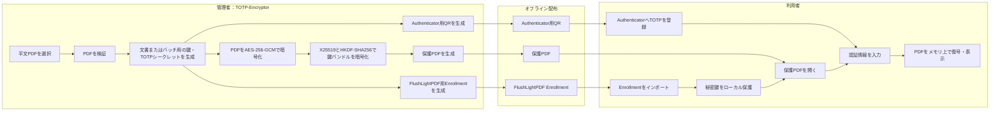

<!-- TOTP Security Flowchart -->README.md
# TOTP Security Technical Specification

## システム全体フロー



## 閲覧可否の判定フロー

```mermaid
flowchart TD
    A["保護PDFを開く"] --> B{"Enrollment済み？"}
    B -->|いいえ| NG["閲覧拒否"]
    B -->|はい| C{"秘密鍵を解除できる？"}
    C -->|いいえ| NG
    C -->|はい| D{"信頼できる現在時刻を取得できる？"}
    D -->|いいえ| NG
    D -->|はい| E{"有効期間内？"}
    E -->|いいえ| NG
    E -->|はい| F{"鍵バンドルの認証に成功？"}
    F -->|いいえ| NG
    F -->|はい| G{"OTPが必要？"}
    G -->|はい| H{"OTPは有効？"}
    H -->|いいえ| NG
    H -->|はい| I{"PDFの認証・復号に成功？"}
    G -->|いいえ| I
    I -->|いいえ| NG
    I -->|はい| OK["メモリ上でPDFを表示"]

flowchart TD
    S([暗号化開始]) --> M{処理モード}

    M -->|新規文書／新規バッチ| N1[平文PDFを選択]
    M -->|既存バッチへ追加| B1[.flpdf-batchを選択]

    B1 --> B2[管理者パスフレーズを入力]
    B2 --> B3{プロジェクトの<br/>復号・認証に成功?}
    B3 -->|いいえ| E1[エラー表示]
    E1 --> X([処理終了])
    B3 -->|はい| B4[既存のbatch_id・受信者鍵・<br/>K_totp・有効期間ポリシーを復元]
    B4 --> N1

    N1 --> V1{入力PDFは<br/>正常に解析可能?}
    V1 -->|いいえ| E2[不正なPDFとして拒否]
    E2 --> X
    V1 -->|はい| SCOPE{鍵スコープ}

    SCOPE -->|文書単位・既定| K1[文書ごとに受信者X25519鍵ペアと<br/>K_totpを生成]
    SCOPE -->|共有バッチ| K2{既存バッチか?}

    K2 -->|いいえ| K3[batch_id・共有受信者鍵ペア・<br/>共有K_totpを生成]
    K2 -->|はい| K4[既存の共有鍵・K_totpを再利用]

    K1 --> P1
    K3 --> POLICY
    K4 --> POLICY

    POLICY[有効期間ポリシーを設定<br/>valid_from / valid_until<br/>allow_local_time / ntp_profile_id] --> P1

    P1[対象PDFごとに処理] --> P2[一意なdocument_idを生成]
    P2 --> P3[ランダムなK_encを生成]
    P3 --> P4[ランダムな12バイトIVを生成]
    P4 --> P5[平文PDFをAES-256-GCMで暗号化<br/>AADにdocument_id等を設定]

    P5 --> P6[鍵バンドルを生成<br/>K_enc・K_totp・document_id・policy]
    P6 --> P7[一時X25519鍵ペアを生成]
    P7 --> P8[X25519共有秘密を導出]
    P8 --> P9[ランダムなHKDF saltを生成]
    P9 --> P10[HKDF-SHA256でK_wrapを導出]
    P10 --> P11[K_wrapで鍵バンドルを<br/>AES-256-GCM暗号化]

    P11 --> P12[/Custom_OTP_Dataを構築<br/>一時公開鍵・salt・IV・tag等]
    P12 --> P13[暗号化PDFペイロードと<br/>メタデータをPDFへ格納]
    P13 --> MORE{未処理のPDFがある?}

    MORE -->|はい| P1
    MORE -->|いいえ| EN1[Google Authenticator用<br/>otpauth QRを生成]
    EN1 --> EN2[FlushLightPDF Enrollmentを生成<br/>X25519秘密鍵とTOTP情報を含む]
    EN2 --> WARN[Bearer Secret警告を表示]

    WARN --> SAVE{バッチプロジェクトを保存?}
    SAVE -->|はい| SAVE1[管理者パスフレーズで<br/>.flpdf-batchを暗号化保存]
    SAVE -->|いいえ| CLEAN
    SAVE1 --> CLEAN

    CLEAN[K_enc・K_totp・K_wrap・秘密鍵・<br/>平文PDFバッファをゼロ化] --> OK([暗号化完了])

