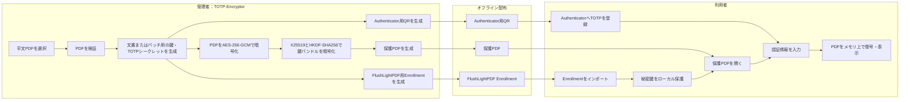

```mermaid
flowchart LR
    subgraph ADMIN["管理者：TOTP-Encryptor"]
        A1["平文PDFを選択"]
        A2["PDFを検証"]
        A3["文書またはバッチ用の鍵・TOTPシークレットを生成"]
        A4["PDFをAES-256-GCMで暗号化"]
        A5["X25519とHKDF-SHA256で鍵バンドルを暗号化"]
        A6["保護PDFを生成"]
        A7["Authenticator用QRを生成"]
        A8["FlushLightPDF用Enrollmentを生成"]
    end

    subgraph DISTRIBUTION["オフライン配布"]
        D1["保護PDF"]
        D2["Authenticator用QR"]
        D3["FlushLightPDF Enrollment"]
    end

    subgraph USER["利用者"]
        U1["AuthenticatorへTOTPを登録"]
        U2["Enrollmentをインポート"]
        U3["秘密鍵をローカル保護"]
        U4["保護PDFを開く"]
        U5["認証情報を入力"]
        U6["PDFをメモリ上で復号・表示"]
    end

    A1 --> A2 --> A3 --> A4 --> A5 --> A6
    A3 --> A7
    A3 --> A8

    A6 --> D1 --> U4
    A7 --> D2 --> U1
    A8 --> D3 --> U2
    U2 --> U3 --> U4
    U1 --> U5
    U4 --> U5 --> U6
```
